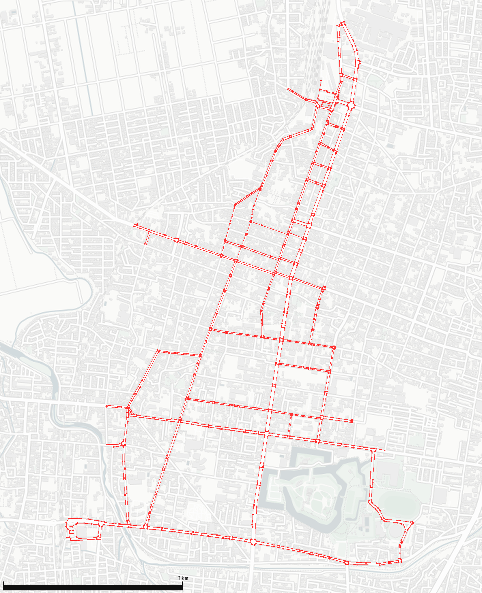
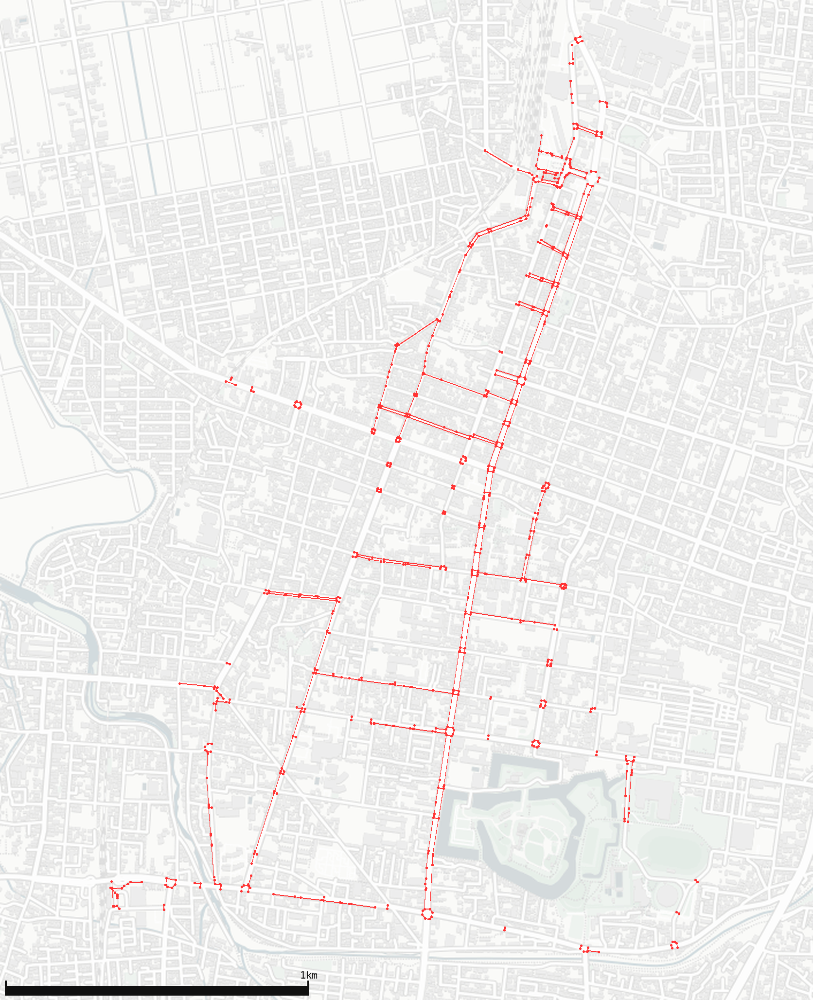

# dim\_pedestrian\_walkway\_graph
A visualizer of the "spatial network model for pedestrians"

## description
This project has two tools to visualize the **"spatial network model for pedestrians[^1]"**.

[^1]: https://www.mlit.go.jp/common/001177505.pdf

1. [data_importer](./data_importer)  
    1. First, [dim](https://github.com/ryo-ma/dim) fetches the "spatial network model for pedestrians" data (Node csv and Link csv) from open data APIs.
    2. Once a data fetch process is complete, dim will launch [this preprocess command](./data_importer/preprocess_command/src) as a docker container automatically.
    3. The launched container imports the fetched data into [FIWARE](https://github.com/Fiware).
2. [graph_viewer](./graph_viewer)
    1. Once both the Node csv and Link csv have been imported into FIWARE, you can visualize the graph of patial network model for pedestrians like below:

* Render all nodes and links.
    * 
* Render all nodes, but render only walkways that wheelchairs and robots can easily pass through (widths of 3m or more and gentle slopes).
    * 

## Preparation
1. Get and install dim
    * First of all, install [dim](https://github.com/ryo-ma/dim) according to the procedure described in the dim's [README](https://github.com/ryo-ma/dim/blob/main/README.md).
1. Clone this repository.
    ```
    » git clone https://github.com/nmatsui/dim_pedestrian_walkway_graph.git
    » cd ./dim_pedestrian_walkway_graph
    ```
## How to use
### Start FIWARE
1. Start FIWARE orion as a docker container and make sure it starts correctly.
    ```
    dim_pedestrian_walkway_graph - [main] » cd fiware
    dim_pedestrian_walkway_graph/fiware - [main] » docker compose up -d
    dim_pedestrian_walkway_graph/fiware - [main] » curl -v http://<<your ip address>>:1026/v2/entities/
    ...
    < HTTP/1.1 200 OK
    ...
    []* Closing connection 0
    
    dim_pedestrian_walkway_graph/fiware - [main] » cd ..
    ```
### Import data into FIWARE orion
1. Set the ip address of FIWARE orion.  
   (The following command is an example when the IP address of your PC is 192.168.10.10.)
    ```
    dim_pedestrian_walkway_graph - [main] » cd data_importer
    dim_pedestrian_walkway_graph/data_importer - [main] » sed -e 's/<<your_ip_address>>/192.168.10.10/g' config/fiware_config.json.tmpl > config/fiware_config.json
    ```
1. Build a docker container importing data to FIWARE orion.
    ```
    dim_pedestrian_walkway_graph/data_importer - [main●] » cd preprocess_command
    data_importer/preprocess_command - [main] » docker build -t data_importer:0.1.0 .
    data_importer/preprocess_command - [main] » cd ..
    ```
1. Fetch data and import them into FIWARE orion by using dim.
    ```
    dim_pedestrian_walkway_graph/data_importer - [main●] » dim install
    ```
1. Confirm imported data.
    ```
    dim_pedestrian_walkway_graph/data_importer - [main●] » curl -sS -H "fiware-service: pedestrian_walkway_graph" -H "fiware-servicepath:/fukushima/aizuwakamatsu" "http://192.168.10.10:1026/v2/entities/?type=Node&limit=2" | jq .
    [
      {
        "id": "305258",
        "type": "Node",
        "floor": {
          "type": "number",
          "value": 0,
          "metadata": {}
        },
        "in_out": {
          "type": "integer",
          "value": 1,
          "metadata": {}
        },
        "lat": {
          "type": "number",
          "value": 37.4915265,
          "metadata": {}
        },
        "lon": {
          "type": "number",
          "value": 139.9286769,
          "metadata": {}
        }
      },
      {
        "id": "305257",
        "type": "Node",
     ...
    ]
    dim_pedestrian_walkway_graph/data_importer - [main●] » curl -sS -H "fiware-service: pedestrian_walkway_graph" -H "fiware-servicepath:/fukushima/aizuwakamatsu" "http://192.168.10.10:1026/v2/entities/?type=Link&limit=2" | jq .
    [
      {
        "id": "322656",
        "type": "Link",
        "brail_tile": {
          "type": "integer",
          "value": "1",
          "metadata": {}
        },
        "direction": {
          "type": "integer",
          "value": "1",
          "metadata": {}
        },
        "end_id": {
          "type": "string",
          "value": "305257",
          "metadata": {}
        },
    ...
    ]
    
    dim_pedestrian_walkway_graph/data_importer - [main●] » cd ..
    ```
### Visualize the graph of patial network model for pedestrians
1. Set the ip address of FIWARE orion.  
   (The following command is an example when the IP address of your PC is 192.168.10.10.)
    ```
    dim_pedestrian_walkway_graph - [main●] » cd graph_viewer
    dim_pedestrian_walkway_graph/graph_viewer - [main] » sed -e 's/<<your_ip_address>>/192.168.10.10/g' config/viewer_config.json.tmpl > config/viewer_config.json
    ```
1. Build a docker container rendering data retrieved from FIWARE orion.
    ```
    dim_pedestrian_walkway_graph/graph_viewer - [main●] » docker build -t graph_viewer:0.1.0 .
    ```
1. Render graph  
    ```
    dim_pedestrian_walkway_graph/graph_viewer - [main●] » docker run -it -v $(pwd)/config:/opt/config -v $(pwd)/dist:/opt/dist graph_viewer:0.1.0 -c /opt/config/viewer_config.json -s all /opt/dist/map_all.png
    ```
    * You can set `all`, `class1`, `class2` and `class3` as `-s` option. 
    * Each class represents a decision logic to connect sidewalks. See [strategies.py](./graph_viewer/src/viewer/strategies.py) for more details.

## license
[Apache-2.0 License](./LICENSE)

## copyright
Copyright (c) 2022, [Nobuyuki Matsui](mailto:nobuyuki.matsui@gmail.com)
